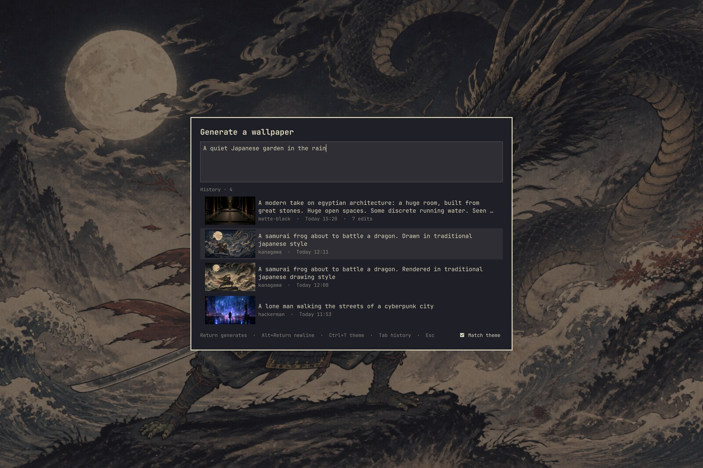
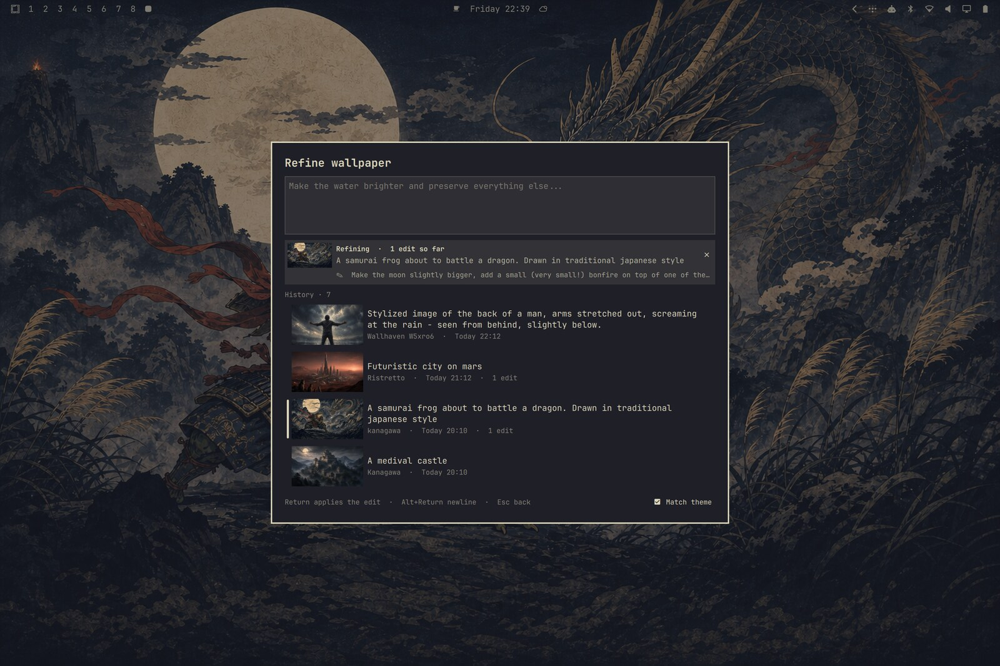

# Wallsmith

Generate, revisit, and refine AI wallpapers for [Omarchy](https://omarchy.org) — theme-aware, crop-safe, keyboard-first.



Made with Wallsmith on the **Kanagawa** theme, from the prompt *“A samurai frog about to battle a dragon. Drawn in traditional japanese style”*:


## Requirements

- Omarchy 4 with `omarchy-shell`
- [Codex CLI](https://github.com/openai/codex), signed in — generation runs on your Codex account, no API key needed
- `hyprctl`, `jq`, ImageMagick, `flock` (all on stock Omarchy)

## Install

```bash
omarchy plugin add https://github.com/jlugner/omarchy-wallsmith.git --enable
```

Wallsmith has no default keybinding — pick one and bind the launcher in `~/.config/hypr/bindings.lua`, then run `hyprctl reload`:

```lua
o.bind(
  "SUPER + CTRL + G",
  "Generate wallpaper",
  "$HOME/.config/omarchy/plugins/jesperlugner.wallsmith/bin/wallsmith"
)
```

To uninstall, remove the keybinding and run `omarchy plugin remove jesperlugner.wallsmith`. Generated wallpapers stay in `~/.config/omarchy/backgrounds/`; delete them and `~/.local/state/omarchy-wallsmith/` for a full cleanup.

## Use

Your keybinding opens one card: a prompt on top, your generated wallpapers below. Type an idea, press `Return` — the wallpaper generates in the background, applies when done, and lands in history.

In the prompt:

| Key | Action |
|-----|--------|
| `Return` | Generate — or apply the edit while refining |
| `Alt+Return` | Insert a newline |
| `Ctrl+T` | Toggle theme matching (`Shift+Return` submits once without it) |
| `Tab` / `Down` | Move into history |
| `Esc` | Back out, then close |

On a wallpaper in history:

| Key | Action |
|-----|--------|
| `Return` / click | Refine it — edits continue in that wallpaper's own agent thread |
| `Alt+Return` | Apply it as your background |
| `Shift+Return` | Reuse its prompt for a new wallpaper |
| `Alt+T` | Create a matching Omarchy theme from it |
| `Delete` | Delete it — or cancel its running job |



While refining, the strip shows the wallpaper, its prompt, and your past edit instructions. Refinements replace the wallpaper's file — one slot per generation, however many edits — but the last five versions are kept: browse them with `Alt+←/→` (or click the thumbnail) and restore one with `Ctrl+Return`. A restore is itself undoable.

`Alt+T` turns a wallpaper into a full Omarchy theme: the palette is extracted from the pixels, the agent assigns roles and names the theme from the image and your prompt, contrast is validated, and the theme is applied immediately with the wallpaper bundled in. Keep it by doing nothing; click the notification to discard it and return to your previous theme. Remove one later with `omarchy theme remove <name>`. For hands-on palette tuning with sliders and presets, see [aether](https://github.com/bjarneo/aether).

Up to four jobs run in parallel: generations run side by side as live rows, while each wallpaper takes one edit at a time. Running jobs show a spinner next to a wallpaper icon in the bar.

The launcher also works from the CLI:

```bash
bin/wallsmith "A quiet Japanese garden in the rain"   # prefill the prompt
bin/wallsmith --no-theme-context "A warm desert"      # ignore the theme once
bin/wallsmith --history                               # open focused on history
```

## How it works

- Reads your displays from `hyprctl monitors -j` and the active theme's `colors.toml`, then asks `codex exec` to craft an image prompt and invoke `$imagegen` once.
- Keeps the composition crop-safe for every display ratio and normalizes to the largest monitor; Omarchy center-crops the shared image per screen.
- Refinements resume the wallpaper's saved Codex session with the current pixels attached as the editing reference, then replace the file atomically.
- State lives in `~/.local/state/omarchy-wallsmith/`: records, version snapshots, and job logs (pruned after 30 days when no record references them). History is capped at the newest 50 wallpapers.

## Verify

```bash
omarchy plugin validate ~/.config/omarchy/plugins/jesperlugner.wallsmith
~/.config/omarchy/plugins/jesperlugner.wallsmith/tests/test-launcher.sh
~/.config/omarchy/plugins/jesperlugner.wallsmith/tests/test-worker.sh
```

The same checks run in CI on every push.

## License

[MIT](LICENSE)
